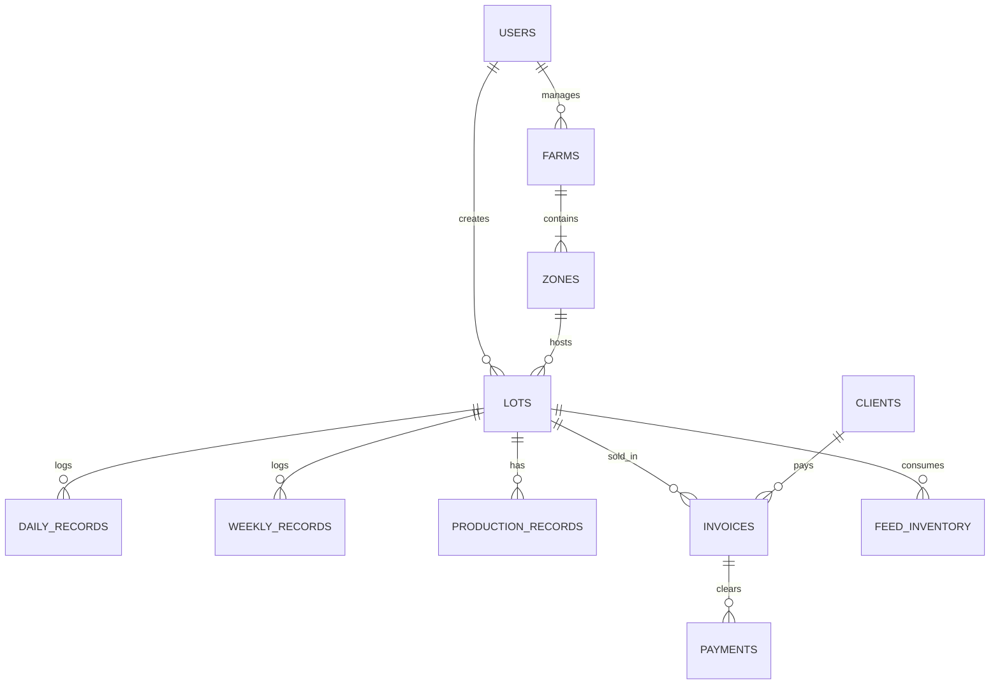

# Plan de Implementación: Backend API - Chicken Flow

Este plan propone la arquitectura, diseño de base de datos y orden de implementación para la API Backend del portal avícola **Chicken Flow**, cubriendo el módulo piloto original y los 12 módulos funcionales especificados.

## Arquitectura Propuesta

- **Tecnología Principal**: Node.js con Express, desarrollado en **TypeScript** para robustez y autotipado de peticiones/respuestas.
- **Base de Datos**: **PostgreSQL** (según lo recomendado en la documentación).
- **ORM / Query Builder**: **Prisma** o **Kex/Sequelize** (se propone **Prisma ORM** por su facilidad para manejar TypeScript de forma nativa).
- **Autenticación**: JWT (JSON Web Tokens) mediante el header `Authorization: Bearer <token>`.
- **Estructura del Proyecto**:
  - `src/config/`: Configuración de base de datos, variables de entorno y Passport/JWT.
  - `src/controllers/`: Controladores encargados de manejar las peticiones HTTP.
  - `src/middleware/`: Middleware de autenticación, validación de schemas y manejo de errores.
  - `src/models/` o `prisma/schema.prisma`: Definición del modelo de datos.
  - `src/routes/`: Definición de endpoints versionados (`/api/v1/...`).
  - `src/services/`: Capa de lógica de negocio (cálculos de FCR, mortalidad, rentabilidad, etc.).
  - `src/utils/`: Helpers, validaciones comunes y formateadores de respuestas.

---

## User Review Required

> [!IMPORTANT]
> **Elección de ORM y Lenguaje**: Proponemos usar **Node.js + Express + TypeScript + Prisma ORM + PostgreSQL**. Si prefiere no usar ORM y escribir SQL directo, o usar JavaScript en lugar de TypeScript, por favor indíquelo.
> 
> **Ambiente y Base de Datos**: Confirmar si las credenciales de base de datos serán configuradas localmente para desarrollo mediante Docker (ej: `docker-compose`) o si hay un servidor PostgreSQL de desarrollo disponible.

---

## Open Questions

> [!IMPORTANT]
> 1. **Gestión de Usuarios (Módulo 12)**: ¿Debemos pre-cargar roles (ej: Administrador, Operador, Consultor) y un usuario semilla inicial, o implementamos el registro abierto de usuarios (`/api/v1/auth/register`)?
> 2. **Cálculos Financieros (Módulo 10)**: La documentación indica que el frontend tiene los cálculos, pero el backend debe persistir los datos brutos. Sin embargo, endpoints como `/api/v1/pilot/lots/:id/final-report` y `/api/v1/dashboard/summary` requieren consolidación. ¿Desea que el backend calcule y retorne estas proyecciones dinámicamente usando las fórmulas descritas en la documentación, o que se envíen calculadas desde el frontend?

---

## Diseño del Schema de Base de Datos (PostgreSQL)

Proponemos una estructura relacional que unifique el módulo piloto y los módulos avanzados:

### Tablas a Implementar:

1. **`users`**: ID, nombre, correo, password (hash), rol, fecha_creacion.
2. **`farms`**: ID, nombre, ubicacion, area_m2, zonas_cant, capacidad, estado, responsible_id (FK a `users`), fecha_mantenimiento.
3. **`zones`**: ID, farm_id (FK), nombre, capacidad_m2, estado.
4. **`lots`**: ID, code (L-YYYY-XXX), farm_id (FK), zone_id (FK), birds_initial, birds_alive, start_date, expected_harvest_date, duration_days, status, price_pollito, cost_heaters, cost_transport, cost_processing, cost_delivery, price_sale_lb, expected_weight, expected_carcass_weight, created_by (FK a `users`).
5. **`daily_records`**: ID, lot_id (FK), cycle_day, date, birds_alive_start, birds_dead, death_cause, feed_thrown_kg, feed_type, water_changed, temp_morning, temp_afternoon, observations.
6. **`weekly_records`**: ID, lot_id (FK), week_number, start_day, end_day, date, weights (ARRAY o columnas pollo_1..5), avg_weight, feed_consumed, birds_dead, observations.
7. **`feed_inventory`**: ID, farm_id (FK), feed_type, quantity_kg, unit_price, supplier, updated_at.
8. **`clients`**: ID, name, nit_rut, email, phone, address, status.
9. **`invoices`**: ID, client_id (FK), lot_id (FK), code (invoice number), issue_date, weight_sold_lb, total_amount, status.
10. **`payments`**: ID, invoice_id (FK), payment_date, amount, payment_method, status (pendiente, completado).

---

## Proposed Changes

A continuación se detalla el plan de desarrollo agrupado por fases lógicas para cubrir todos los módulos de `api/modulos`:

### Fase 1: Configuración Inicial y Autenticación
#### [NEW] [package.json](file:///home/kevin/Documents/Chicken%20Flow/package.json)
- Configurar dependencias: `express`, `typescript`, `@types/node`, `prisma`, `@prisma/client`, `jsonwebtoken`, `bcryptjs`, `dotenv`, `cors`, `morgan`.
#### [NEW] [tsconfig.json](file:///home/kevin/Documents/Chicken%20Flow/tsconfig.json)
- Ajustes de TypeScript para el entorno Node.js.
#### [NEW] [src/app.ts](file:///home/kevin/Documents/Chicken%20Flow/src/app.ts)
- Servidor Express con middlewares globales, ruteador `/api/v1` y control de errores.
#### [NEW] [prisma/schema.prisma](file:///home/kevin/Documents/Chicken%20Flow/prisma/schema.prisma)
- Definición completa del schema basado en el diseño relacional.
#### [NEW] [src/routes/auth.routes.ts](file:///home/kevin/Documents/Chicken%20Flow/src/routes/auth.routes.ts)
- Rutas de Login y Registro de usuarios (Módulo 12).

### Fase 2: Módulo de Granjas e Infraestructura
#### [NEW] [src/routes/farms.routes.ts](file:///home/kevin/Documents/Chicken%20Flow/src/routes/farms.routes.ts)
- Implementación de endpoints de `02-granjas.md`:
  - `GET /api/v1/farms`
  - `GET /api/v1/farms/:id`
  - `POST /api/v1/farms`
  - `PUT /api/v1/farms/:id`
  - `GET /api/v1/farms/options`

### Fase 3: Módulo Piloto y Gestión de Lotes
#### [NEW] [src/routes/pilot.routes.ts](file:///home/kevin/Documents/Chicken%20Flow/src/routes/pilot.routes.ts)
- Implementación de los endpoints unificados de `03-modulo-piloto.md` y `endpoints-avicola.md`:
  - `GET /api/v1/pilot/lots`
  - `GET /api/v1/pilot/lots/:id`
  - `POST /api/v1/pilot/lots`
  - `PUT /api/v1/pilot/lots/:id`
  - `GET /api/v1/pilot/lots/:id/daily-records`
  - `POST /api/v1/pilot/lots/:id/daily-records`
  - `GET /api/v1/pilot/lots/:id/weekly-records`
  - `POST /api/v1/pilot/lots/:id/weekly-records`
  - `GET /api/v1/pilot/lots/:id/final-report` (Lógica de indicadores calculados en backend).

### Fase 4: Ciclos Escalonados, Producción e Inventario
#### [NEW] [src/routes/lots.routes.ts](file:///home/kevin/Documents/Chicken%20Flow/src/routes/lots.routes.ts)
- Endpoints de `04-ciclo-escalonado-lotes.md` y `05-produccion.md`.
#### [NEW] [src/routes/inventory.routes.ts](file:///home/kevin/Documents/Chicken%20Flow/src/routes/inventory.routes.ts)
- Endpoints de `06-inventario-alimento.md` (Entradas, salidas y alertas de stock de alimento).

### Fase 5: Módulos Comerciales y Financieros
#### [NEW] [src/routes/clients.routes.ts](file:///home/kevin/Documents/Chicken%20Flow/src/routes/clients.routes.ts)
- Endpoints de `07-clientes.md`.
#### [NEW] [src/routes/invoices.routes.ts](file:///home/kevin/Documents/Chicken%20Flow/src/routes/invoices.routes.ts)
- Endpoints de `08-ventas-facturas.md` y `09-pagos-cobros.md`.
#### [NEW] [src/routes/finance.routes.ts](file:///home/kevin/Documents/Chicken%20Flow/src/routes/finance.routes.ts)
- Endpoints de `10-finanzas-utilidades.md` y `11-reportes.md`.

---

## Verification Plan

### Automated Tests
- Scripts de pruebas con **Supertest** y **Jest** para verificar las validaciones del negocio:
  - Validar límites de cantidad de pollitos (múltiplos de 12, entre 12 y 500).
  - Validar que los registros diarios no permitan duplicar el día del ciclo.
  - Validar que los pollos vivos no puedan incrementarse respecto al día anterior.
  - Comprobación de autenticación JWT correcta e incorrecta.

### Manual Verification
- Archivo `requests.http` para testing rápido con extensiones como REST Client o POSTMAN, conteniendo llamadas de ejemplo con tokens simulados para cada endpoint implementado.
